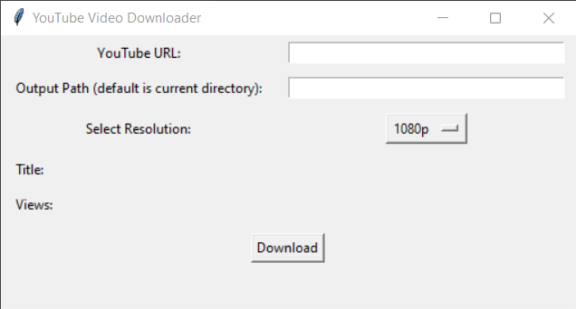

# YouTube Video Downloader

A Python application with a graphical user interface (GUI) for downloading YouTube videos.

## Features

- Download YouTube videos in various resolutions.
- User-friendly GUI built with Tkinter.
- Displays video information such as title and views.
- Allows users to specify the output path for downloaded videos.

## Prerequisites

- Python 3.x
- Install required Python packages:

  ```bash
  pip install pytube

## How to Use

1. **Clone the repository:**

   ```bash
   git clone https://github.com/yourusername/youtube-video-downloader.git

2. **Change to the project directory:**

    ```bash
   cd youtube-video-downloader
   
3. **Run the application:**

    ```bash
   python downloader.py

4. **Enter the YouTube URL, select the resolution, and provide the output path.**

5. **Click the "Download" button to initiate the download.**

## Screenshots

